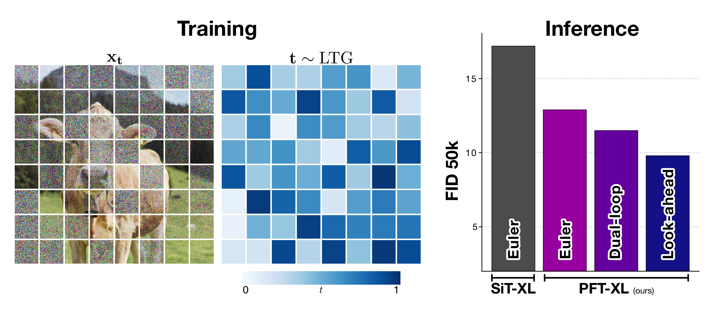
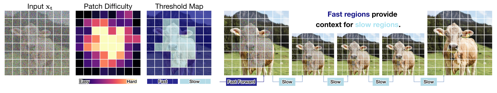
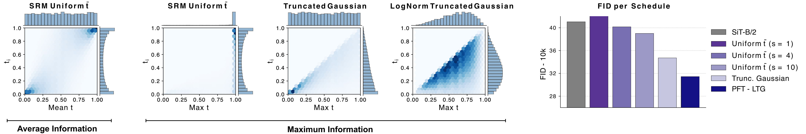
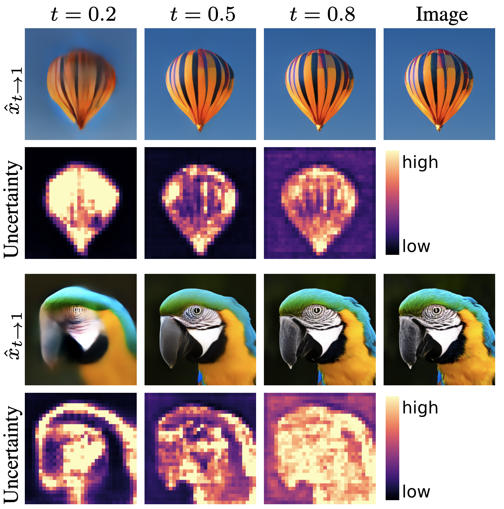
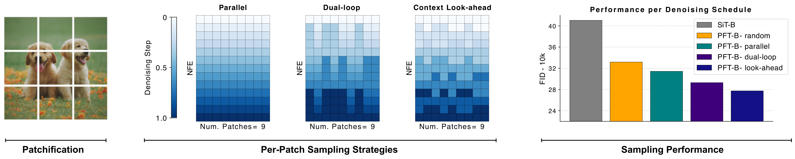

<p align="center">
 <h2 align="center">Denoising, Fast and Slow: Difficulty-Aware Adaptive Sampling for Image Generation</h2>
 <p align="center">
 <b>
 Johannes Schusterbauer<sup>*</sup> · Ming Gui<sup>*</sup> · Yusong Li · Pingchuan Ma · Felix Krause · Björn Ommer
 </b>
 <p align="center"> 
    CompVis Group @ LMU Munich, Munich Center for Machine Learning (MCML)
 </p>
 <p align="center"> 
    CVPR 2026
 </p>
</p>
 </p>
<div align="center">


[]()
[](https://github.com/CompVis/patch-forcing)

<p align="center"> <sup>*</sup> <i>equal contribution</i> </p>

</div>


<p align="center">

</p>

# 🚀 TL;DR


**Patch Forcing turns denoising into a spatially adaptive process.** During training, different image patches receive heterogeneous timesteps. While conceptually straightforward, this only works well with a dedicated timestep sampler that controls how much clean information is exposed per sample, closing the train–test gap where inference starts from pure noise. This framework enables dynamic sampling strategies, where easy regions can be denoised faster and provide cleaner context for harder ones.


🔥 **Contributions**
- Patch-wise timesteps $\rightarrow$ enables heterogeneous denoising
- LTG timestep sampler $\rightarrow$ fixes train-test mismatch
- Patch difficulty-guided sampling $\rightarrow$ allocates compute adaptively





# 📖 Overview


Natural images are highly spatially heterogeneous: some regions (e.g. backgrounds) are easy to denoise, while others (e.g. fine structures, text) require more refinement and context.
However, standard diffusion and flow-based models treat all regions equally, applying the same timestep and compute everywhere.


**Key idea**: move from global to patch-wise denoising, where different regions follow different noise trajectories.


### Training

Naively assigning random timesteps per patch does *not work*. When timesteps are sampled independently and uniformly, most training samples contain a mix of noisy and already partially clean regions. As a result, the model learns to rely on this implicit context, even though such states never occur at inference, where generation starts from pure noise. This creates a clear train–test mismatch.

<p align="center">

</p>

Prior work (SRM) addresses this by controlling the average amount of information per sample. While this partially mitigates the issue, it does not fully resolve it: even if the average is well-behaved, individual patches can still be nearly clean. In practice, this means that almost every training example still contains highly informative regions.


Our key idea is to instead **control the maximum information** available in each sample. Concretely, we first sample a maximum timestep and then restrict all patch-wise timesteps to lie below it. This prevents any region from becoming too clean during training and ensures that the model consistently operates in regimes that match inference.

With this simple change, heterogeneous patch-wise denoising works! Even without any adaptive sampling at inference, this training strategy already improves generation quality over standard diffusion models with uniform timesteps.


### Inference

To fully leverage patch-wise denoising at inference, we need to decide **which regions should be denoised faster** and **which require more refinement**. For this, we augment the model with a lightweight uncertainty (difficulty) head that predicts, for each patch, how reliable the current denoising velocity prediction is.

<p align="center">

</p>

With heterogeneous denoising and the uncertainty head, we base our adaptive samplers on three key findings:

- **context helps denoising** $\rightarrow$ advancing confident (easy) regions provides cleaner context that improves predictions in harder regions
- **uncertainty reflects patch difficulty** $\rightarrow$ higher uncertainty correlates with higher validation loss
- **more context reduces uncertainty** $\rightarrow$ cleaner neighboring regions make difficult patches easier to denoise

These findings naturally lead to adaptive sampling strategies that allocate compute where it is most useful. Instead of denoising all patches uniformly, we use the predicted uncertainty to guide the process: easy regions are advanced more aggressively, while difficult ones receive additional refinement.


<p align="center">

</p>

- The **dual-loop** sampler alternates between quickly advancing confident patches and refining uncertain ones with smaller steps.
- The **look-ahead** sampler goes one step further by explicitly advancing confident patches into the future and using their cleaner states as context for denoising harder regions.

**Together, these strategies turn patch-wise heterogeneity into adaptive inference, improving generation quality under the same compute budget by focusing effort where it matters most.**


Please refer to our paper for a more detailed description of our framework. 😉


# 🛠️ Code Setup

This codebase is based on Python `3.12` and the packages listed in [requirements.txt](/export/home/ru59wap/projects/patch-forcing/requirements.txt).

First, clone the repository:

```bash
git clone git@github.com:CompVis/patch-forcing.git
cd patch-forcing
```

Then create the environment and install the dependencies:

```bash
conda create -n pft python=3.12
conda activate pft
pip install -r requirements.txt
```

If the default install fails on your machine, follow the safer install order noted in ?`requirements.txt`: install `torch` and `torchvision` first, then `flash-attn`, then the remaining requirements.

We release two Patch Forcing checkpoints: [PFT-B](https://ommer-lab.com/files/pft/pft-b_step400k_ema.ckpt) and [PFT-XL](https://ommer-lab.com/files/pft/pft-xl_step400k_ema.ckpt). The checkpoints contain the EMA weights, as well as the model config.

### Class-Conditional Generation

#### Inference

To generate class-conditional samples use:

```bash
python scripts/sample.py \
  --ckpt /path/to/model.ckpt \
  --sample-fn-config configs/sampler/dual-loop.yaml \
  --num-sampling-steps 100 \
  --cfg-scale 4.0
  # ... you can add sampler specific args via dot-notation
```

For FID samples use `scripts/sample_ddp.py`:

```bash
torchrun --standalone --nproc_per_node=8 scripts/sample_ddp.py \
  --ckpt /path/to/model.ckpt \
  --sample-fn-config configs/sampler/euler-pf.yaml \
  --per-proc-batch-size 64 \
  --num-fid-samples 50000 \
  --num-sampling-steps 100 \
  --cfg-scale 1.0
```

If your checkpoint comes from training and does not already contain the compact `config` + `state_dict` format expected by the samplers, convert it first:

```bash
python scripts/convert_ckpt.py /path/to/training.ckpt
```


#### Training

You can train new models via `train.py`. The repository is based on `hydra`, and the base config lives in `configs/config.yaml`. Experiments in `configs/experiment` overwrite this base config. Use CLI overrides to swap configs or change individual fields, for example `python train.py experiment=imnet-pft-b name=imnet/my-run data=dummy256 train_params.max_steps=10000`.

To directly use the ImageNet-256 webdataset file, configure the ImageNet-256 shard locations in `configs/data/imagenet256.yaml`.
For debugging, use you can use `configs/data/dummy256.yaml`.

Train the main class-conditional experiments with:

```bash
python train.py experiment=imnet-pft-b
python train.py experiment=imnet-pft-xl
```

If you want to use your own dataloader, make sure it returns a dictionary with `image` (bchw tensor normalized to $[-1, 1]$) and `label`.

### Text-to-Image

For text-to-image training, first fill in the gaps in `configs/data/t2i-256.yaml` and then you can train them with

```bash
python train.py experiment=t2i-pft1.2b-qwen
```

The batch should contain a dict with `image`, text (set corresponding text key in trainer), and `img_meta` if you want to include crop size conditioning via RoPE (see `patch_flow/data_utils.py` for more info). The default loader uses random caption sampling (as we used multiple caption lengths during training).

You can use `scripts/t2i_sample.py` to sample images based on a text prompt.


## 🎓 Citation

If you use our work in your research, please use the following BibTeX entry. 🙂

```bibtex
@InProceedings{schusterbauer2025patchforcing,
      title={Denoising, Fast and Slow: Difficulty-Aware Adaptive Sampling for Image Generation},
      author={Johannes Schusterbauer and Ming Gui and Yusong Li and Pingchuan Ma and Felix Krause and Björn Ommer},
      booktitle={Proceedings of the IEEE/CVF Conference on Computer Vision and Pattern Recognition},
      year={2026}
}
```
